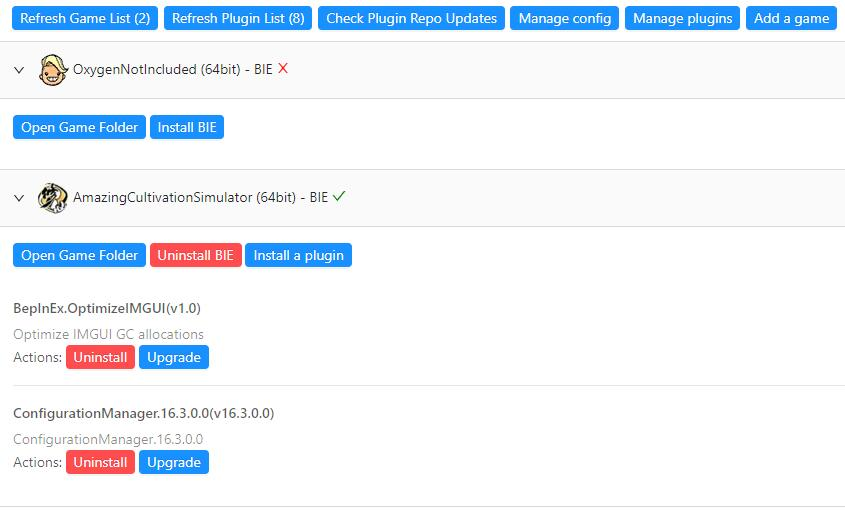
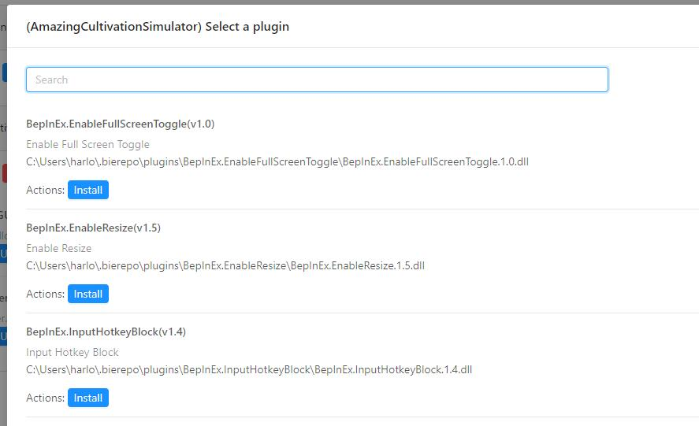
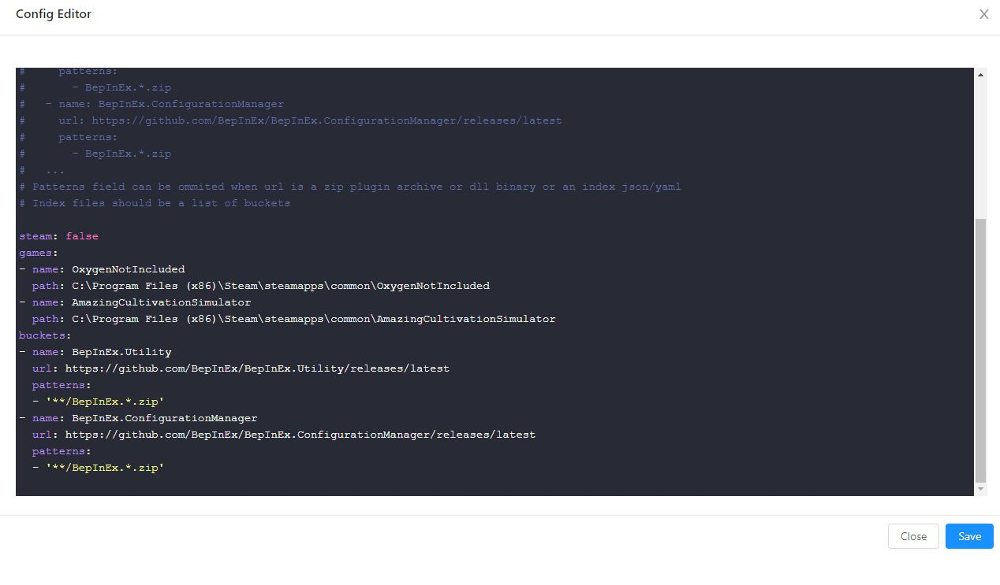

# BepInEx.ModManager
[](https://github.com/hanabi1224/BepInEx.ModManager/actions/workflows/main.yml)
[](https://github.com/hanabi1224/BepInEx.ModManager/blob/main/LICENSE)

This a general mod manager for BepInEx built with Electron.

## Supported platforms

windows

## Features

- Automatically detect and list steam unity games
- Manually add non-steam unity games
- Install / Uninstall BepInEx for a game with automatic detection of 32bit / 64bit
- Install / Uninstall plugins for a game
- Plugin repository / github release page support
- Automatically detect and download plugin updates
- Automatical self update via electron-updater

## Installation

Download and install from the [release](https://github.com/hanabi1224/BepInEx.ModManager/releases/latest) page for the first time.

The tool will update itself automatically once installed.

Install [.Net Framework 4.6.2 runtime](https://dotnet.microsoft.com/download/dotnet-framework/thank-you/net462-web-installer) if it's missing

## Development

- Install [.Net Framework 4.6.2 SDK](https://dotnet.microsoft.com/download/dotnet-framework/thank-you/net462-developer-pack-offline-installer)
- Install [.Net 5 SDK](https://dotnet.microsoft.com/download/dotnet/5.0)
- Install [nodejs lts](https://nodejs.org/en/)
- Install [yarn](https://classic.yarnpkg.com/en/docs/install#windows-stable)
- Install npm package with ```yarn```
- Run with ```yarn start```
- Package installer with ```yarn dist```

## Screenshots




